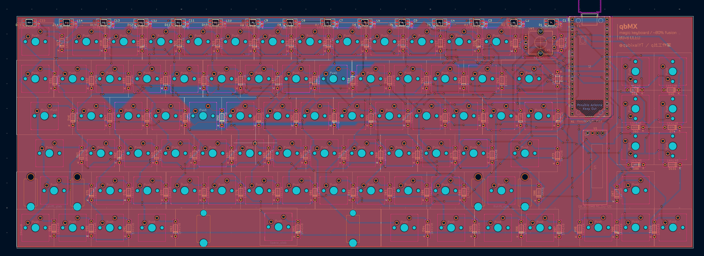
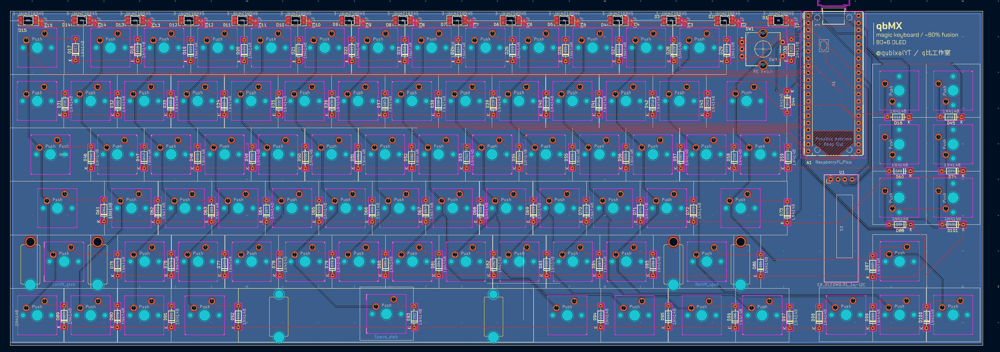
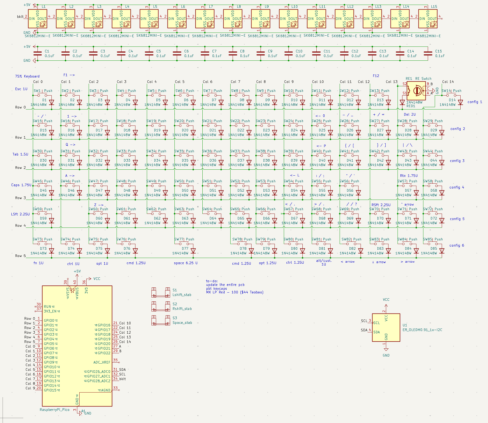
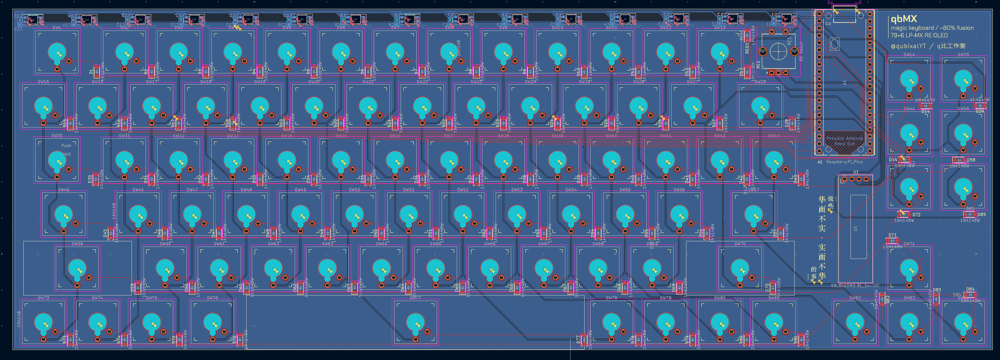
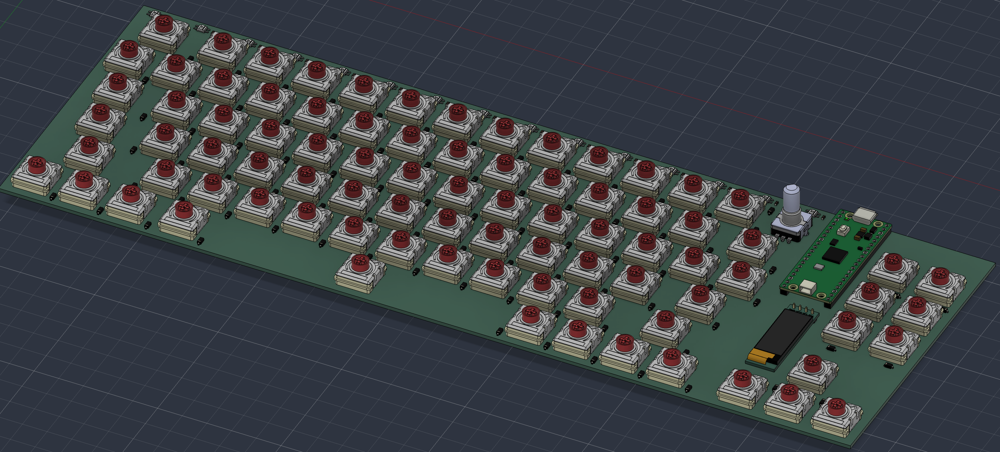
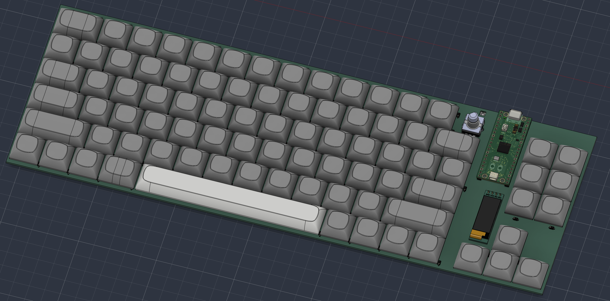
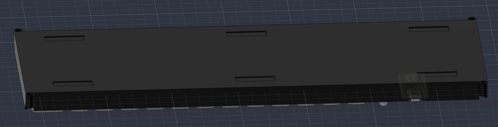
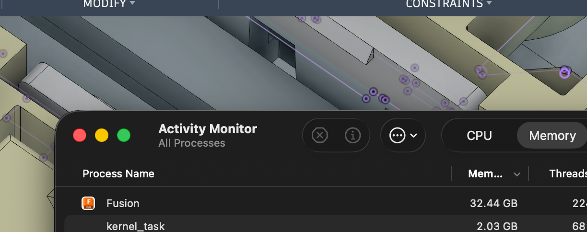
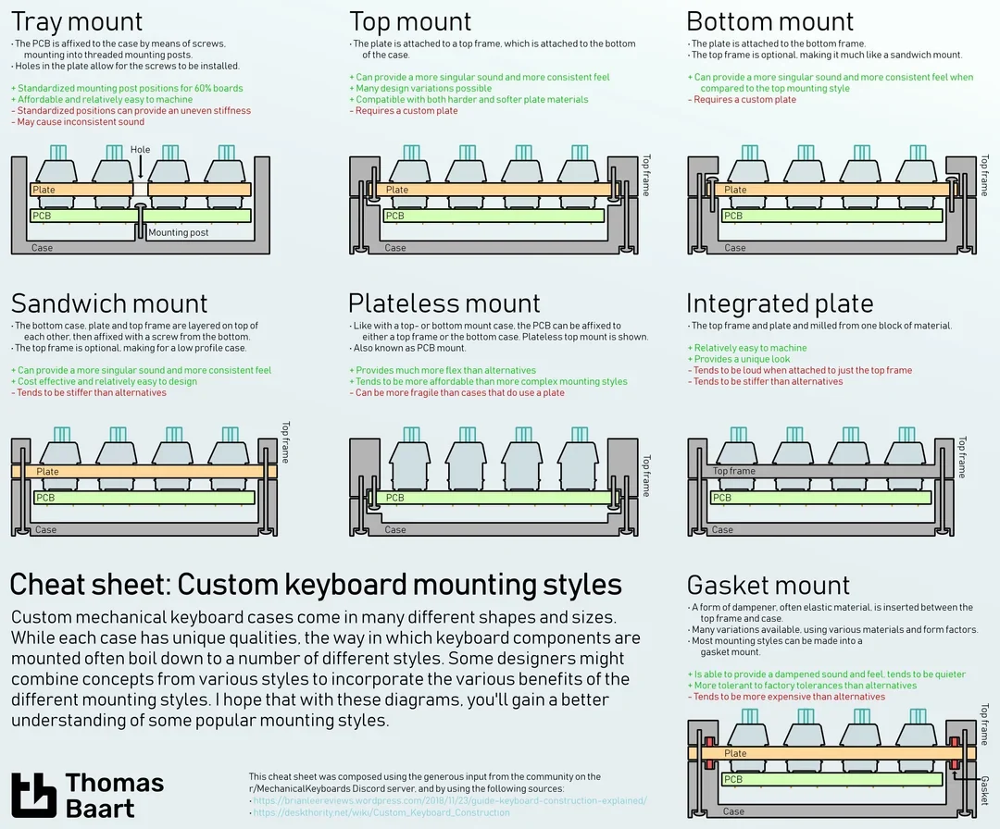
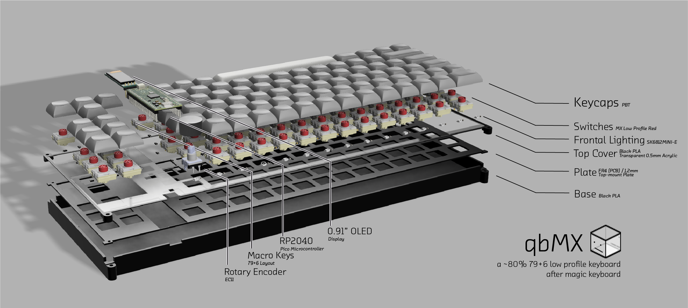

# Journal

## Build Log / Journal
*note, the KiCad project was not git initialised, and so does not show up under hackatime as a distinct project. The hours are accurate estimates based on daily overviews.

### 1. Planning & schematic —  _5 hrs_
I followed the guide and started planning. Functionalities:
RP2040 microcontroller (), 0.91" OLED screen (2 GPIO), Rotary Encoder (2 GPIO), Keys (21 GPIO, 6 rows 15 columns), "Backlight" (1GPIO) total 26GPIO.

Originally, i designed this for standard size MX switches and did not understand the difference, keyboard sizes (i.e. 60%, 75%, 80%, etc) or keycap u sizes.

I handplaced each key which resulted in this taking ages. At this time, I just autorouted to save some time.

### 2. PCB layout — _2 hrs_

Hand-routed the matrix. When I applied the 3D models, I noticed something was off and reconfigured everything.

### 3. Redesign — _6 hrs_

Refactored entire keyboard from scratch after several issues with geographical annotation messing up the keys. Other key changes that happened were:
MX switches -> MX Low Profile Red switches,
On-PCB Stabalisers -> On-Plate Stabalisers (due to lack of footprints available)

Marbastlib was so useless and had nothing, so I had to refactor what I had anyways. Switched to a mix of Marbastlib and siderakb/key-switches.pretty.
To save time placing components, i installed kbplacer. However, i had to retweak every reference number because my LEDs conflicted with diodes, and rotary encoder was counted as a switch. Doing this wouldn't have been a problem if my keyboard wasn't already laid out.

I also fetched the 3D models for everything and exported to fusion which took a long time yet again, as I had to find a new rotary encoder with an appropriate height.

### 4. Outer Case Design — _8 hrs_

Added keycaps to the model.

Also, modified the bottom so that I could stick in silicone stoppers.

Exported STEP files are available in /prod-3d-models.

So how the heck did creating a rectangle box of doom and despair take 8 hours?
I think it can be explained in one screenshot:

In case you're still clueless, that's fusion taking up 32GB of ram. Apparently having 85 switches and a few more bits ad pieces kills your computer.

I'm still quite happy with the end result. The overall hierarchy is:
 ------- Top cover (+ acrylic sheet), 0.5mm
 keycaps + microcontroller
 ------- Plate (FR4, in PCB form), 1.2mm
 switches and PCB
 ------- Bottom Case
The overall design is a Top mount keyboard design.

### 5. Ordering & assembly — _1 hrs_

BOM is almost finalised.
Total expected cost of project is: ~$136 usd (excluding orpheus pico).
The final render is seen below:

### 6. Firmware — 3 hrs

Wrote bare-metal Pico SDK firmware (in C) for the RP2040 microcontroller. Each file is broken down below:
- **matrix.c**: scans the 6x15 keyboard with 5ms per-key debouncing
- **usb_descriptors.c**: device identification + HID report, USB VID:PID 0xCafe:0x4005
- **oled.c**: SSD1306 128x32 OLED driver over I2C1 with 5 toggleable pages (listed on README)
- **leds.c**: 15 SK6812MINI-E LED chain via PIO, with a startup rainbow wave animation + warm white / RGB cycle modes
- **encoder.c**: rotary encoder, quadrature decoding -> volume up/down
- **main.c**: 1ms polling rate that controls everything, calculates WPM and manages RP2040 internal temp sensor.

> NOTE: AI WAS USED to dramatically speed up the matrix and fonts; saving me a lot of work here.

USB CDC serial interface was added to receive Mac CPU/GPU temperatures, using the protocol `T:<cpu_avg>:<gpu_avg>\n` over USB serial at 115200 baud.
Host-side Python script (`host_temp.py`) reads Mac temps via `osx-cpu-temp` and sends to Pico, and it is then displayed on a page on the OLED Screen.